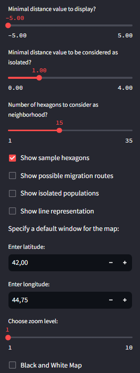

# STARGEN (Spatio-Temporal Analysis and Reconstruction of GENetic Barriers)

## Overview

STARGEN is a novel bioinformatics tool designed to visualize genetic distances between ancient DNA samples across different time periods and geographic locations. By integrating spatial and temporal dimensions, STARGEN provides insights into genetic barriers, migration routes, and isolated populations, thereby contributing to the understanding of human population dynamics and historical gene flow.

## Prerequisites

Before running the tool, ensure you have the following software and libraries installed:

- Python 3.12.2
- conda 23.7.4

## Installation

1. Clone this repository to your local machine:

   ```bash
   git clone git@github.com:JaSt17/STARGEN.git
   cd STARGEN/
   ```
2. Run the setup script to create a new conda environment and install all necessary packages.

   You can easily set up the Conda environment using the provided `stargen.yml` file by following these steps:

   ```bash
   # Create the Conda environment
   conda env create -f setup/stargen.yml
   # Activate the environment
   conda activate stargen
   ```

   Or you can also run the setup scripts on Linux or Windows:

   On Linux run:

   ```bash
   chmod +x setup/setup.sh
   ./setup/setup.sh
   ```

   On Windows run:

   ```powershell
   .\setup\setup.ps1
   ```

   If the installation of the conda environment and dependencies does not work using the setup file, please install the dependencies manually:

   - streamlit=1.32.0
   - streamlit-folium=0.20.0
   - folium=0.16.0
   - pandas=2.2.1
   - numpy=1.26.4
   - scipy=1.13.0
   - statsmodels=0.14.1
   - h3-py=3.7.6
   - haversine=2.8.1
   - branca=0.7.1
   - matplotlib=3.8.3
   - openpyxl=3.1.2

You can also use the requirements.txt file in the setup/ directory.

## Initial Run

Before running the tool for the first time, ensure you have the "aDNA_30GPs.xlsx" file in the `0_data/` directory. This file contains the ancient DNA samples necessary for the analysis.

To use a different samples/distance file, you need to modify the initial_run.py script to match your file's format. Specifically, you must update the script with the appropriate column names and the index from which the distance values start in your Excel file.

##### File Requirements:

Your file should contain the following columns:

* ID: A unique identifier for each sample.
* LAT: Latitude of the geographic coordinates of the sample.
* LON: Longitude of the geographic coordinates of the sample.
* Age: The age of the sample in years before 1950 AD. For example, if a sample is dated to 200 BC, the age should be recorded as 2150.
  In addition to these columns, your file should include as many columns as there are elements in your distance vector. In our case, this is 30.

##### Example file:

| ID       | LAT        | LON         | Age   | Distance 1 | Distance 2 | ... | Distance 30 |
| -------- | ---------- | ----------- | ----- | ---------- | ---------- | --- | ----------- |
| Sample 1 | Latitude 1 | Longitude 1 | Age 1 | Value 1.1  | Value 2.1  | ... | Value 30.1  |
| Sample 2 | Latitude 2 | Longitude 2 | Age 2 | Value 1.2  | Value 2.2  | ... | Value 30.2  |
| Sample 3 | Latitude 3 | Longitude 3 | Age 3 | Value 1.3  | Value 2.3  | ... | Value 30.3  |

##### Steps to Adjust the Script in case you are using your own file:

* Open the initial_run.py script in your preferred text editor or IDE.
* Locate the section where you can change the column names and the index.
* Update the script to reflect the correct column names for your file.
* Adjust the index to match where the distance values begin in your file.

In case you are using your own excel file please change "0_data/aDNA_30GPs.xlsx" to the path to your file.

##### Run the initial script to process the data and create the necessary distance matrix and other files:

On Linux run:

```bash
python scr/initial_run.py 0_data/aDNA_30GPs.xlsx
```

On Windows run:

```powershell
python scr\initial_run.py 0_data\aDNA_30GPs.xlsx
```

This script performs the initial data processing, which includes:

1. **Data Filtering**: Reads the Excel file and filters out rows with invalid or missing latitude and longitude values.
2. **Sample List Generation**: Extracts relevant columns from the filtered data and writes the ancient samples to a new text file.
3. **Distance Matrix Calculation**: Computes the Euclidean distance matrix from the admixture data and saves it as a pickle file.

### Output

- `Ancient_samples.txt`: A text file with the filtered ancient sample data.
- `1_dist_matrix/eucl_dist.pkl`: A pickle file containing the Euclidean distance matrix.

Ensure the path to the Excel file is correct when running the script to avoid errors.

## Pre-Execution Checklist

- Ensure the conda environment "stargen" or your chosen environment is created and activated.
- Ensure your working directory contains the following files:
  - `0_data/Ancient_samples.txt`
  - `1_dist_matrix/eucl_dist.pkl`

## Running the Application

Start the interactive STARGEN application with the following command:

On Linux run:

```bash
streamlit run scr/app.py
```

On Windows run:

```powershell
streamlit run scr\app.py
```

This command should automatically open a browser window with the STARGEN application.

### Application Features

- **Home Screen**: Customize the number of time bins and the resolution of the hexagonal zones. Access additional details through the buttons on the home screen.

  
- **Main Screen**: The Sidebar on the main screen provides additional settings to adjust the visualization of genetic distances.

  

  - **Display Settings**:
    - **Which distances should be displayed**: Exclude distant hexagons below a set threshold.
    - **Isolated populations**: Define the scaled distance value to identify isolated populations and migration routes.
    - **Migration routes & isolated populations**: Draw possible migration routes and isolated hexagons on the map.
    - **Distance lines**: Display underlying distance lines for a detailed view.
    - **Default map window**: Set standard coordinates and zoom level for specific areas of interest.

Now, you can explore genetic distances over time using the interactive folium map from STARGEN.

## Repository Structure

- **0_data**: Holds the xlsx file.

  - `aDNA_30GPs.xlsx`: Contains the combined samples from the AADR and additional samples gathered for this study.

  This file lists the Genetic ID, the Publication, the Date of the sample, the Locality, the Political entity, the coordinates, and the values for the 30 Admixture components.
- **scr**: Contains all the scripts necessary for the tool.

  - `app.py`: Holds the code for the Streamlit application. It allows the interactive usage of the tool.
  - `func.py`: Contains all the necessary functions to run the `app.py` script.
  - `initial_run.py`: Script to be run in the initial setup phase to create the distance matrix from the `aDNA_30GPs.xlsx` file.
  - `visualize.py`: Contains all functions used to visualize the hexagons, lines, and legend on the Folium map.

## Methodology and Validation

STARGEN employs several advanced techniques for genetic data analysis, including:

- **Data Retrieval**: Uses datasets from the Allan Ancient DNA Resources (AADR) and other supplementary sources.
- **Euclidean Distance Computation**: Utilizes supervised ADMIXTURE analyses to calculate genetic distances.
- **Spatial Segmentation**: Implements the H3geo algorithm for hexagonal spatial segmentation.
- **Delaunay Triangulation**: Ensures robust spatial relationships between hexagons.
- **LOWESS Curve Fitting**: Scales genetic distances to geographic distances for each time bin.
- **Neighboring Hexagon Identification**: Identifies and visualizes genetic distances between hexagons.

STARGEN has been validated by identifying known genetic barriers, such as the Bering Sea, and accurately detecting migration routes, such as those influenced by Norse maritime activities.

For detailed methodology and results, refer to the supplementary material and figures included in the manuscript.

## References

A comprehensive list of references is included in the manuscript. Key references include foundational studies on genetic population structure, geographic patterns of genetic variation, and methodologies for spatial genetic analysis.

---

This README provides detailed instructions for running STARGEN and replicating the results presented in the associated manuscript.
